# 🎵 ZeeM – Aesthetic Music Player

## Home

<p align="center">
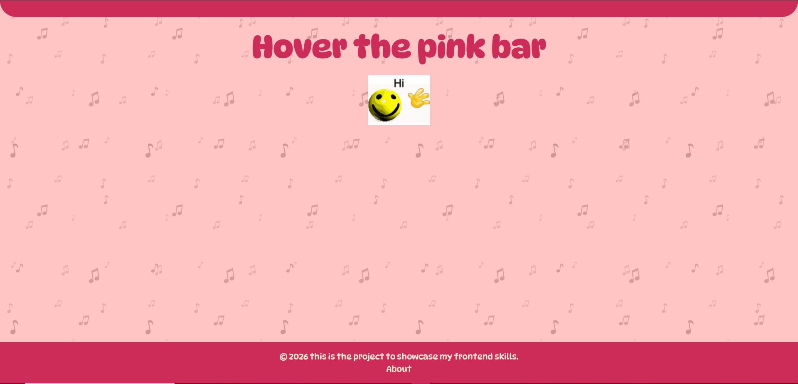
</p>

<p align="center">
  <b>A modern React music player with multiple aesthetic listening modes, synchronized playlists, artist & song search, animated backgrounds, and immersive UI themes.</b>
</p>

---

## Features

- Six immersive music modes
  - Dreaminess
  - Joy
  - Party
  - Sad
  - Cozy
  - Comfort
- Playlist navigation
- Music controls
- Animated video backgrounds
- Dynamic UI themes
- Artist search
- Song search
- Responsive layout
- Fast React application
- Cute aesthetic UI
- Animated music-note background
- Smooth transitions and interactions

---

# Preview

## Party Mode

<p align="center">
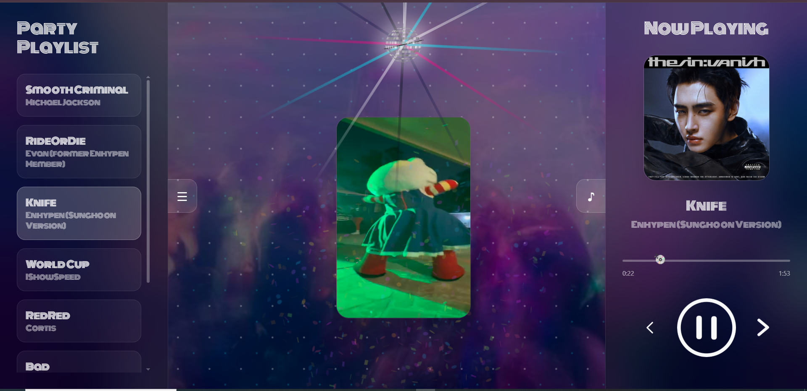
</p>

---

## Sad Mode

<p align="center">
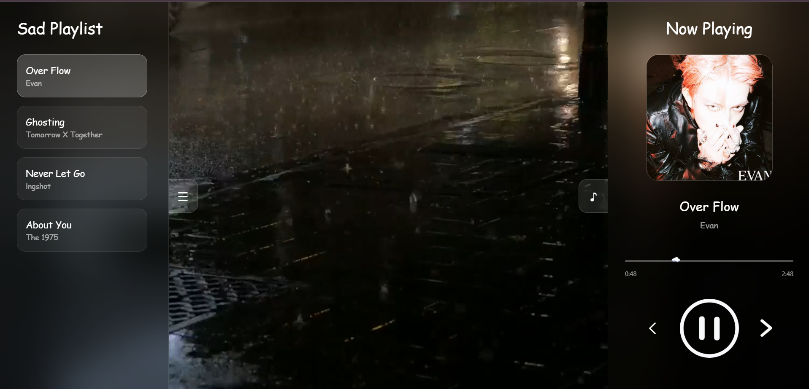
</p>

---

## Cozy Mode

<p align="center">
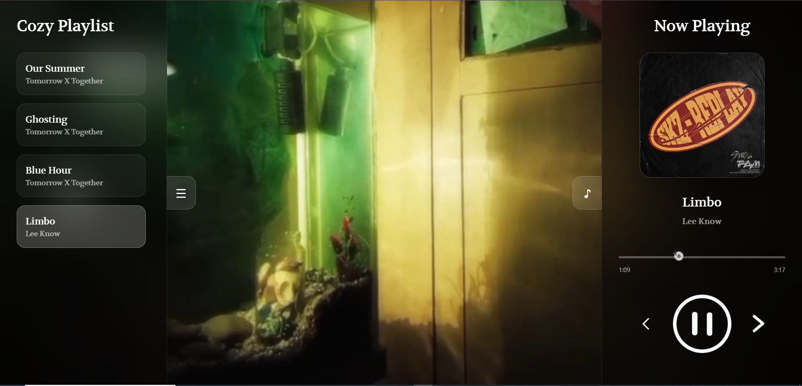
</p>

---

## Dreaminess Mode

<p align="center">
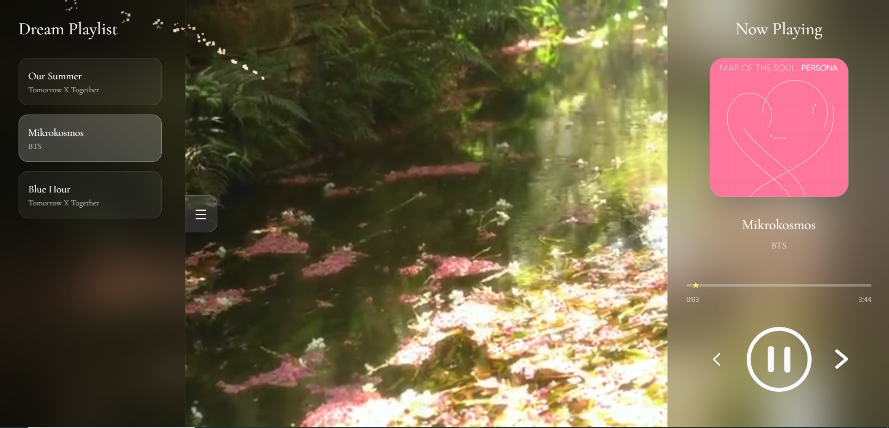
</p>

---

## Joy Mode

<p align="center">
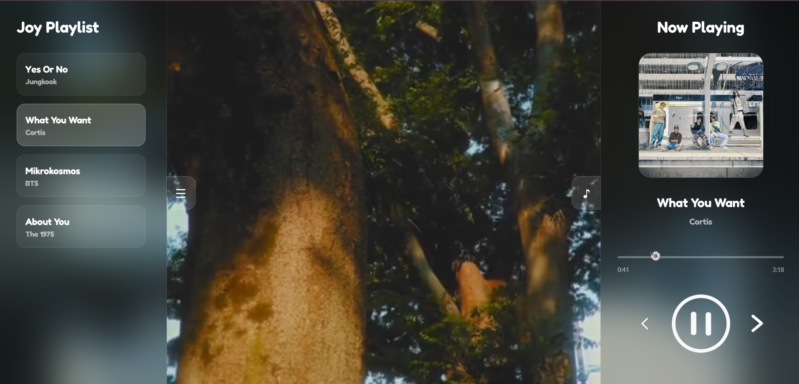
</p>

---

## 🤍 Comfort Mode

<p align="center">
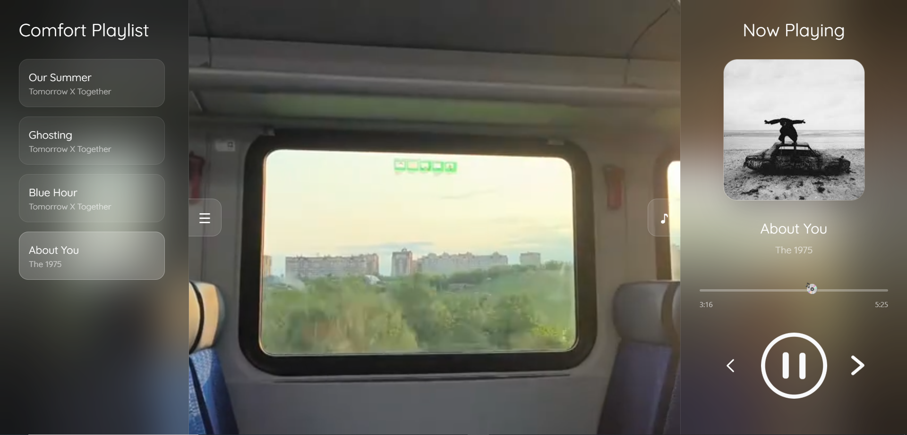
</p>

---

## Artist Search

<p align="center">
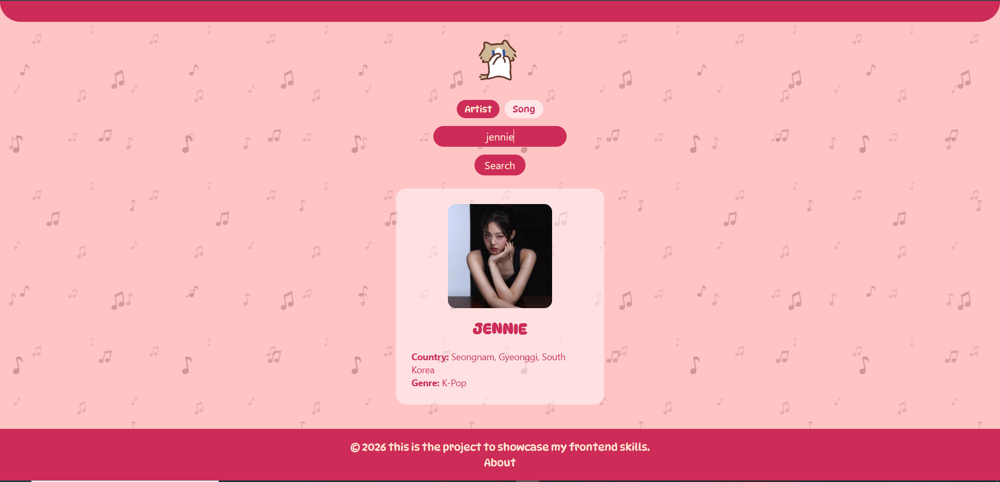
</p>

---

## Song Search

<p align="center">
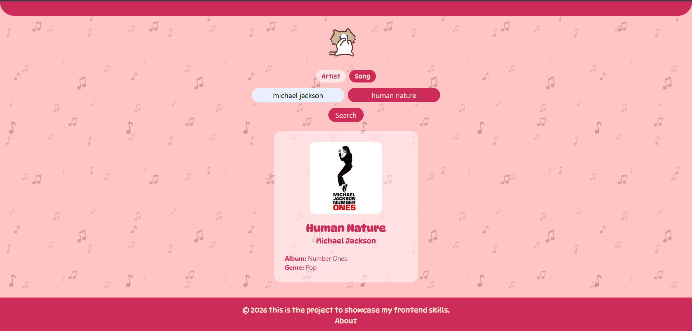
</p>

---

## Navigation & Information

<p align="center">
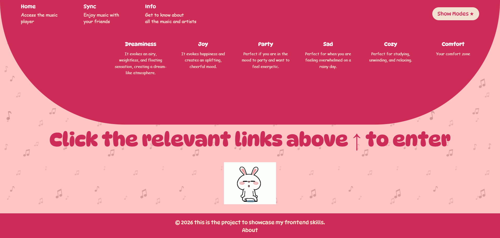
</p>

---

## Behind the Project

<p align="center">
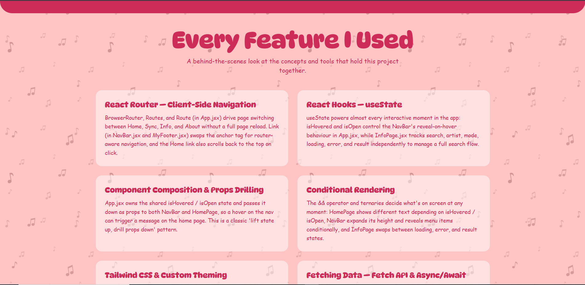
</p>

---

# Built With

- React
- JavaScript (ES6+)
- React Router
- HTML5
- CSS3
- Fetch API
- Responsive Design
- Google Fonts
- SVG Animations

---

# React Concepts Used

- React Components
- Component Composition
- Props
- useState
- Conditional Rendering
- React Router
- Client-side Navigation
- Event Handling
- Fetch API
- Async / Await
- Dynamic Styling
- Responsive Design

---

# Project Goals

This project was built to:

- Practice React development
- Explore client-side routing
- Work with APIs
- Improve component architecture
- Create multiple themed user interfaces
- Build an engaging frontend experience
- Strengthen portfolio-quality UI design

---

# Installation

Clone the repository

```bash
git clone https://github.com/syeda-hira-batool/music-player.git
```

Go into the project

```bash
cd music-player
```

Install dependencies

```bash
npm install
```

Run the development server

```bash
npm run dev
```

---

# Future Improvements

- Spotify integration
- Music recommendations
- Authentication
- Favorites playlist
- Volume control
- Shuffle & Repeat
- Lyrics support
- Playlist creation
- Theme customization
- Sync music with friends

---

# Author

**Syeda Hira Batool**

GitHub: https://github.com/syeda-hira-batool
